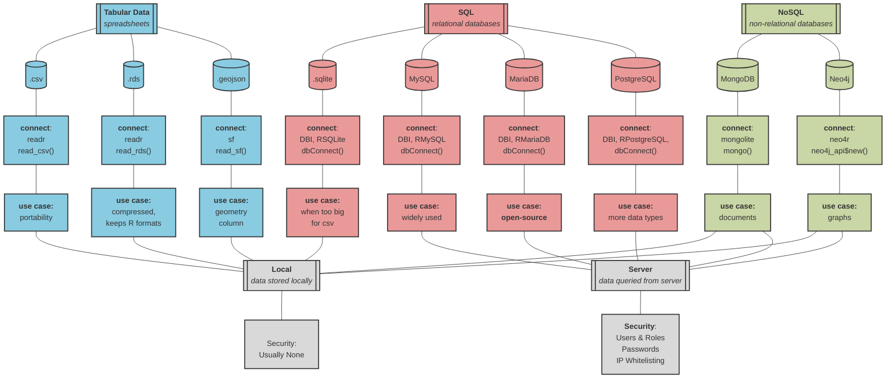

# sts
Exercises for course on Data Science for Socio-Technical Systems

## Cheat Sheets

### Using Databases in R

```mermaid

flowchart TD

local[["<b>Local</b><br><i>data stored locally</i>"]]
server[["<b>Server</b><br><i>data queried from server</i>"]]
tabular[["<b>Tabular Data</b><br><i>spreadsheets</i>"]]
sql[["<b>SQL</b><br><i>relational databases</i>"]]
nosql[["<b>NoSQL</b><br><i>non-relational databases</i>"]]

sqlite[(".sqlite")]
rds[(".rds")]
geojson[(".geojson")]
csv[(".csv")]
mysql[("MySQL")]
mariadb[("MariaDB")]
postgres[("PostgreSQL")]
mongodb[("MongoDB")]
neo4j[("Neo4j")]

read_csv["<b>connect</b>:<br>readr<br>read_csv()"]
use_csv["<b>use case:</b><br>portability"]

read_geojson["<b>connect</b>:<br>sf<br>read_sf()"]
use_geojson["<b>use case:</b><br>geometry<br>column"]

read_rds["<b>connect</b>:<br>readr<br>read_rds()"]
use_rds["<b>use case:</b><br>compressed,<br>keeps R formats"]

read_sqlite["<b>connect</b>:<br>DBI, RSQLite<br>dbConnect()"]
use_sqlite["<b>use case:</b><br>when too big<br>for csv"]

read_mysql["<b>connect</b>:<br>DBI, RMySQL<br>dbConnect()"]
use_mysql["<b>use case:</b><br>widely used"]

read_mariadb["<b>connect</b>:<br>DBI, RMariaDB<br>dbConnect()"]
use_mariadb["<b>use case:<b><br>open-source"]

read_postgres["<b>connect</b>:<br>DBI, RPostgreSQL,<br>dbConnect()"]
use_postgres["<b>use case:</b><br>more data types"]

read_mongodb["<b>connect</b>:<br>mongolite<br>mongo()"]
use_mongodb["<b>use case:</b><br>documents"]

read_neo4j["<b>connect</b>:<br>neo4r<br>neo4j_api$new()"]
use_neo4j["<b>use case:</b><br>graphs"]

secure_server["<b>Security</b>:<br>Users & Roles<br>Passwords<br>IP Whitelisting"]
secure_local["<br>Security</b>:<br>Usually None"]

tabular --- csv --- read_csv --- use_csv --- local
tabular --- rds --- read_rds --- use_rds --- local
tabular --- geojson --- read_geojson --- use_geojson --- local


sql ---  sqlite --- read_sqlite --- use_sqlite --- local
sql --- mysql --- read_mysql --- use_mysql --- server 
sql --- mariadb --- read_mariadb --- use_mariadb --- server 
sql --- postgres --- read_postgres --- use_postgres --- server 

nosql --- mongodb --- read_mongodb --- use_mongodb 
nosql --- neo4j --- read_neo4j --- use_neo4j

use_mongodb --- local
use_mongodb --- server
use_neo4j --- local
use_neo4j --- server 

local --- secure_local
server --- secure_server

classDef type1 fill:#ea9999,stroke:#333,stroke-width:2px;
classDef type2 fill:#c9d6a5,stroke:#333,stroke-width:2px;
classDef type3 fill:#89cce2,stroke:#333,stroke-width:2px;
classDef type4 fill:#d9d9d9,stroke:#333,stroke-width:2px;
classDef type5 fill:#d9d9d9,stroke:#333,stroke-width:2px;

class sql,mysql,mariadb,postgres,sqlite,read_mysql,read_mariadb,read_postgres,use_mysql,use_mariadb,use_postgres,read_sqlite,use_sqlite, type1;
class nosql,mongodb,neo4j,read_mongodb,use_mongodb,read_neo4j,use_neo4j type2;
class tabular,csv,rds,geojson,read_csv,read_geojson,read_rds,use_csv,use_geojson,use_rds type3;
class local,secure_local, type4;
class server,secure_server, type5;

```
