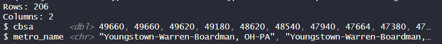
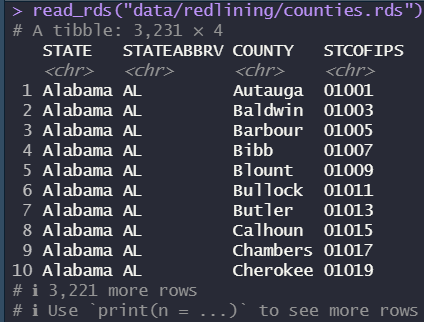
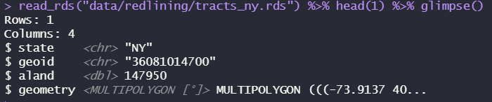

# README '/redlining'

## 🗂️ Historic Redlining Indicator (HRI) Dataset

This dataset classifies U.S. census tracts by degree of historic redlining based on digitized **Home Owners’ Loan Corporation (HOLC)** security maps from the 1930s. It supports spatial analysis of structural racism in the housing market across time and geography.

------------------------------------------------------------------------

## Prerequisites

Be sure to load these packages before trying to work with the data below. Some are written in `sf` spatial features format and will not preview correctly otherwise. Many are saved as compressed R Data Storage `.rds` files to conserve space and retain all column formats.

``` r
library(dplyr) # for data wrangling
library(readr) # for reading data
library(sf) # for spatial features
```

------------------------------------------------------------------------

### 📜 `redlining.csv`

> “The Home Owners’ Loan Corporation (HOLC) was a U.S. federal agency that graded mortgage investment risk of neighborhoods across the U.S. between 1935 and 1940. HOLC residential security maps standardized neighborhood risk appraisal methods that included race and ethnicity, pioneering the institutional logic of residential ‘redlining.’ The Mapping Inequality Project digitized the HOLC mortgage security risk maps from the 1930s. We overlaid the HOLC maps with 2010 and 2020 census tracts for 142 cities across the U.S. using ArcGIS and determined the proportion of HOLC residential security grades contained within the boundaries. We assigned a numerical value to each HOLC risk category as follows: 1 for “A” grade, 2 for “B” grade, 3 for “C” grade, and 4 for “D” grade. We calculated a historic redlining score from the summed proportion of HOLC residential security grades multiplied by a weighting factor based on area within each census tract. A higher score means greater redlining of the census tract. Continuous historic redlining score, assessing the degree of ‘redlining,’ as well as 4 equal interval divisions of redlining, can be linked to existing data sources by census tract identifier allowing for one form of structural racism in the housing market to be assessed with a variety of outcomes. The 2010 files are set to census 2010 tract boundaries. The 2020 files use the new census 2020 tract boundaries, reflecting the increase in the number of tracts from 12,888 in 2010, to 13,488 in 2020. Use the 2010 HRI with decennial census 2010 or ACS 2010-2019 data. As of publication (10/15/2020) decennial census 2020 data for the P1 (population) and H1 (housing) files are available from census. Updated (8/9/2023) - The Historic Redlining Score has been renamed the Historic Redlining Indicator or HRI. The HRI has also been calculated for Census 2000 boundaries.”

------------------------------------------------------------------------

#### 📊 Variables

| Variable | Description |
|------------------------------------|------------------------------------|
| 📅 `year` | **Census year** for which the HRI score is aligned (e.g., 2000, 2010, 2020) |
| 🏙️ `cbsa` | 5-digit **Core-Based Statistical Area** code for the metropolitan region |
| 🆔 `county` | 5-digit state-county FIPS code uniquely identifying the **county** |
| 🆔 `geoid` | 11-digit FIPS code uniquely identifying the **census tract** |
| 📈 `hri` | **Historic Redlining Indicator** (continuous score from 1 to 4; higher = more redlined) |
| 🟫 `interval` | **Quartile category** of the HRI score: 1 = least redlined, 4 = most redlined |

#### 🔗 Sources

-   🔍 [NCRC Mapping Project](https://ncrc.org/holc/)
-   📊 [NCRC Health Equity Study](https://ncrc.org/holc-health/)
-   📁 [ICPSR Data Archive (Study #141121)](https://archive.icpsr.umich.edu/nanda/view/studies/141121/study-details)

#### ⚠️ Notes

-   The HRI dataset allows linkage with decennial census and ACS data by `tract_id`.
-   Use the HRI version that matches the boundary definitions of your demographic or health dataset (e.g., use 2010 HRI with ACS 2015–2019).
-   For mapping and spatial analysis, `hri_score` can be visualized as a continuous or categorical surface.

#### 📮 Citation & Contact

Please cite the authors as specified in the source links above. For data-related questions, refer to the [ICPSR listing](https://archive.icpsr.umich.edu/nanda/view/studies/141121/study-details).

------------------------------------------------------------------------

### 📦 `cbsa.csv`

Metadata for Census Bureau Statistical Areas (CBSA, a.k.a. metropolitan areas) that appear in the `redlining.csv` dataset. Can be joined into `redlining.csv` via `cbsa`, the unique geographic identifier for each area.

``` r
read_csv("data/redlining/cbsa.csv") %>% glimpse()
```



------------------------------------------------------------------------

### 📦 `counties.rds`

County meta-data, which can be joined into `redlining.rds`'s `county` field via `STCOFIPS` the unique geographic identifier for each county.

``` r
read_rds("data/redlining/counties.rds") %>% glimpse()
```



------------------------------------------------------------------------

### 📦 `tracts.geojson`

Tract polygons, which can be joined into `redlining.csv` via `geoid`, the unique geographic identifier for each census tract. By default, this file is greater than Github's 100 MB limit, so it is stored as `tracts.zip`. You will first have to **unzip** the file to get `tracts.geojson`.

``` r
read_sf("data/redlining/tracts.geojson") %>% glimpse()
```

For a sample, try `tracts_ny.geojson`, which shows just census tracts in New York State.



---


---

← 🏠 [Back to Top](#README-redlining)
