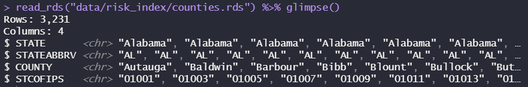
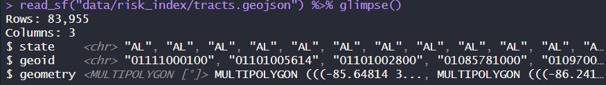

# `README`: 📊 National Risk Index — Census Tract Level

> `data/risk_index/risk.rds`

⚠️ **Note:** This dataset has been processed for tract-level analyses and may omit some original fields. See `risk.rds` for major indicators overall. See `risk_others.rds`for hazard-specific results.


## 🌪️ Overview

The **National Risk Index** (NRI) is a nationwide dataset and online tool developed by **FEMA** that identifies the communities most at risk from **18 natural hazards** across the United States and its territories.

These hazards include:

🌨️ Avalanche • 🌊 Coastal Flooding • ❄️ Cold Wave • 🌾 Drought • 🌎 Earthquake • 🌧️ Hail\
🔥 Heat Wave • 🌀 Hurricane • 🧊 Ice Storm • 🪨 Landslide • ⚡ Lightning\
🌊 Riverine Flooding • 💨 Strong Wind • 🌪️ Tornado • 🌊 Tsunami • 🌋 Volcanic Activity\
🔥 Wildfire • 🌬️ Winter Weather

The index combines:

-   **Expected Annual Loss (EAL)**
-   **Social Vulnerability (SoVI)**
-   **Community Resilience (Resil)**

to produce composite **Risk Index Scores**, **Ratings**, and **Percentiles**.

------------------------------------------------------------------------

### Prerequisites

Be sure to load these packages before trying to work with the data below. Some are written in sf spatial features format and will not preview correctly otherwise. Many are saved as compressed R Data Storage .rds files to conserve space and retain all column formats.

```r
library(dplyr) # for data wrangling
library(readr) # for reading data
library(sf) # for spatial features
```

------------------------------------------------------------------------


## 📦 `risk.rds` Data Format

The `risk.rds` file is a preprocessed R dataframe (original source: FEMA), cleaned for tract-level use.

🗂️ Each row represents a **Census Tract** with the following selected fields:

| Field        | Description                                           |
|--------------|-------------------------------------------------------|
| `TRACTFIPS`  | Unique Census Tract FIPS code                         |
| `POPULATION` | 2020 Population estimate                              |
| `BUILDVALUE` | Building Value ($) |                                  
                                | `AGRIVALUE` | Agriculture Value ($)  |
| `AREA`       | Area (sq mi)                                          |

### 🔥 Risk Index Metrics

| Field        | Description                                |
|--------------|--------------------------------------------|
| `RISK_VALUE` | Risk Index composite value                 |
| `RISK_SCORE` | Composite score                            |
| `RISK_RATNG` | Composite rating (e.g., "Relatively High") |
| `RISK_SPCTL` | State percentile (0–100)                   |

### 💸 Expected Annual Loss (EAL)

| Field | Description |
|--------------------------|----------------------------------------------|
| `EAL_SCORE`, `EAL_RATNG`, `EAL_SPCTL` | Composite score, rating, percentile |
| `EAL_VALT`, `EAL_VALB`, `EAL_VALP`, `EAL_VALPE`, `EAL_VALA` | Loss values (total, building, population, population eq., agriculture) |
| `ALR_VALB`, `ALR_VALP`, `ALR_VALA` | Loss rate per asset type |
| `ALR_NPCTL` | National percentile of loss rate |
| `ALR_VRA_NPCTL` | Loss rate percentile, adjusted for social vulnerability and resilience |

### 📉 Social Vulnerability

| Field        | Description                |
|--------------|----------------------------|
| `SOVI_SCORE` | Social vulnerability score |
| `SOVI_RATNG` | Rating (e.g., "Moderate")  |
| `SOVI_SPCTL` | State percentile (0–100)   |

### 🛡️ Community Resilience

| Field        | Description                      |
|--------------|----------------------------------|
| `RESL_SCORE` | Resilience score                 |
| `RESL_RATNG` | Rating (e.g., "Relatively High") |
| `RESL_SPCTL` | State percentile                 |
| `RESL_VALUE` | Raw resilience value             |

### 📉/🛡 Community Risk Factor

| Field | Description |
|--------------------------|----------------------------------------------|
| `CRF_VALUE` | Community risk factor value - equals the ratio of Social Vulnerability Score over Comunity Resilience Score |

------------------------------------------------------------------------

## 📦 `counties.rds`

County meta-data, which can be joined into `risk.rds` via `STCOFIPS`, the unique geographic identifier for each county.

``` r
read_rds("data/risk_index/counties.rds") %>% glimpse()
```



------------------------------------------------------------------------

## 📦 `tracts.geojson`

Tract polygons, which can be joined into `risk.rds` via `TRACTFIPS`, the unique geographic identifier for each census tract. By default, this file is greater than Github's 100 MB limit, so it is stored as `tracts.zip`. You will first have to **unzip** the file to get `tracts.geojson`.

``` r
read_sf("data/risk_index/tracts.geojson") %>% glimpse()
```



For a sample, try `tracts_ny.geojson`, which shows just census tracts in New York State.

------------------------------------------------------------------------

## 📦 `risk_others.rds` 
# 🌐 National Risk Index — Hazard-Specific Tract Risk (`risk_others.rds`)

> `data/risk_index/risk_others.rds`

📁 Supplementary FEMA NRI data with **hazard-specific tract-level values** for each of the 18 FEMA-defined natural hazards.

Each row corresponds to a **Census Tract**, with columns for:

- 📊 `_EVNTS` → Recorded number of historical hazard events  
- 📈 `_RISKV` → Risk Index value (relative magnitude of hazard impact, in units of expected annual losses in USD conditional on community risk factor)  
- 📉 `_RISKS` → Risk Index score (normalized on 0–100 scale)

---

## ⚠️ Hazards Included

| Hazard             | Prefix | Years of Record     |
|--------------------|--------|---------------------|
| Avalanche          | `AVLN` | 1960–2019           |
| Coastal Flooding   | `CFLD` | N/A                 |
| Cold Wave          | `CWAV` | 2005–2021           |
| Drought            | `DRGT` | 2000–2021           |
| Earthquake         | `ERQK` | 2021 only           |
| Hail               | `HAIL` | 1986–2021           |
| Heat Wave          | `HWAV` | 2005–2021           |
| Hurricane          | `HRCN` | 1851/1949–2021      |
| Ice Storm          | `ISTM` | 1946–2014           |
| Landslide          | `LNDS` | 2010–2021           |
| Lightning          | `LTNG` | 1991–2012           |
| Riverine Flooding  | `RFLD` | 1996–2019           |
| Strong Wind        | `SWND` | 1986–2021           |
| Tornado            | `TRND` | 1950–2021           |
| Tsunami            | `TSUN` | 1800–2021           |
| Volcanic Activity  | `VLCN` | 9310 BC–2022        |
| Wildfire           | `WFIR` | 2021 only           |
| Winter Weather     | `WNTW` | 2005–2021           |

---

## 🧾 Column Structure

Each hazard has three associated columns:

- `<PREFIX>_EVNTS` – Number of recorded events
- `<PREFIX>_RISKV` – Raw Risk Index value
- `<PREFIX>_RISKS` – Normalized Risk Index score (0–100)

🧪 Example for Tornado (`TRND`):
| Column         | Meaning                                 |
|----------------|------------------------------------------|
| `TRND_EVNTS`   | Number of recorded tornado events        |
| `TRND_RISKV`   | Raw risk index value from FEMA      |
| `TRND_RISKS`   | Risk score, percentile-based (0–100)     |

---

## 🔍 Sample Fields

| Column         | Description                                 |
|----------------|---------------------------------------------|
| `STATEABBRV`   | State abbreviation (e.g., `"AL"`)           |
| `STCOFIPS`     | State–County FIPS code                      |
| `TRACTFIPS`    | Census Tract FIPS code                      |
| `HRCN_EVNTS`   | Number of recorded hurricane events         |
| `RFLD_RISKV`   | Risk value for riverine flooding            |
| `TRND_RISKS`   | Normalized risk score for tornadoes         |

---

## 🧼 Missing Data

Not all tracts have historical exposure to every hazard — `NA` values indicate no available or applicable data.

Some hazards (e.g., Tsunami, Volcanic Activity) may have sparse coverage or regional applicability.

---

## 📚 Data Source

📄 FEMA: [National Risk Index (NRI)](https://www.fema.gov/flood-maps/products-tools/national-risk-index)  
📦 Version: March 2023 Release

---

## 🧪 Example (R)

```r
# Load the hazard-specific risk data
read_rds("data/risk_index/risk_others.rds") %>% head()
```

