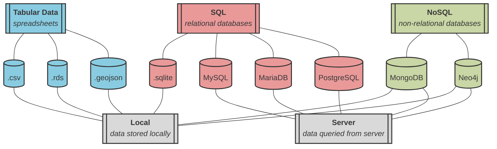

```mermaid

flowchart TD

local[["<b>Local</b><br><i>data stored locally</i>"]]
server[["<b>Server</b><br><i>data queried from server</i>"]]
tabular[["<b>Tabular Data</b><br><i>spreadsheets</i>"]]
sql[["<b>SQL</b><br><i>relational databases</i>"]]
nosql[["<b>NoSQL</b><br><i>non-relational databases</i>"]]

sqlite[(".sqlite")]
rds[(".rds")]
geojson[(".geojson")]
csv[(".csv")]
mysql[("MySQL")]
mariadb[("MariaDB")]
postgres[("PostgreSQL")]
mongodb[("MongoDB")]
neo4j[("Neo4j")]

tabular --- csv ---  local
tabular --- rds --- local
tabular --- geojson  --- local


sql ---  sqlite --- local
sql --- mysql --- server 
sql --- mariadb --- server 
sql --- postgres --- server 

nosql --- mongodb  
nosql --- neo4j 
mongodb --- local
mongodb --- server
neo4j --- local
neo4j --- server 


classDef type1 fill:#ea9999,stroke:#333,stroke-width:2px,color:#373737;
classDef type2 fill:#c9d6a5,stroke:#333,stroke-width:2px,color:#373737;
classDef type3 fill:#89cce2,stroke:#333,stroke-width:2px,color:#373737;
classDef type4 fill:#d9d9d9,stroke:#333,stroke-width:2px,color:#373737;
classDef type5 fill:#d9d9d9,stroke:#333,stroke-width:2px,color:#373737;

class sql,mysql,mariadb,postgres,sqlite,read_mysql,read_mariadb,read_postgres,use_mysql,use_mariadb,use_postgres,read_sqlite,use_sqlite, type1;
class nosql,mongodb,neo4j,read_mongodb,use_mongodb,read_neo4j,use_neo4j type2;
class tabular,csv,rds,geojson,read_csv,read_geojson,read_rds,use_csv,use_geojson,use_rds type3;
class local,secure_local, type4;
class server,secure_server, type5;


```