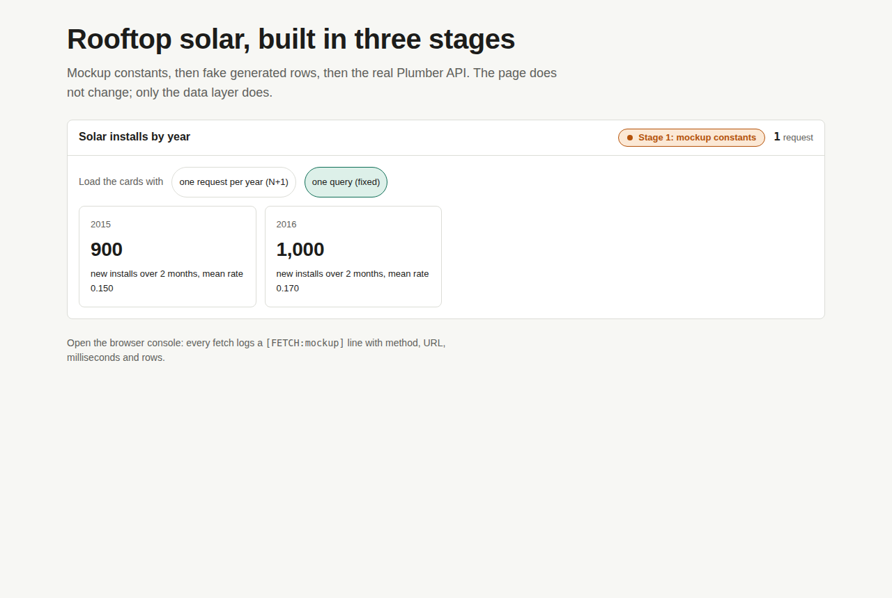
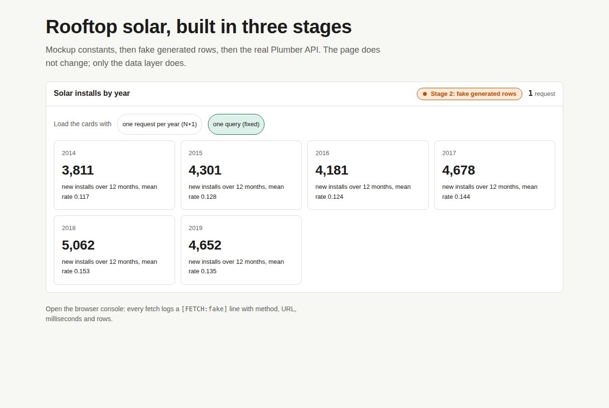
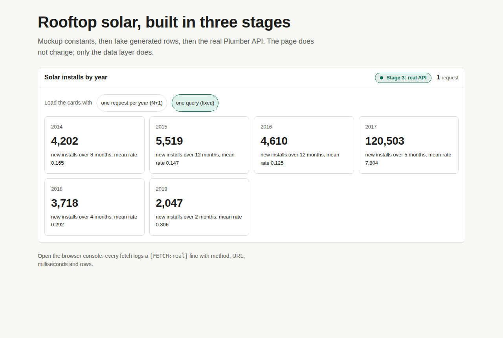
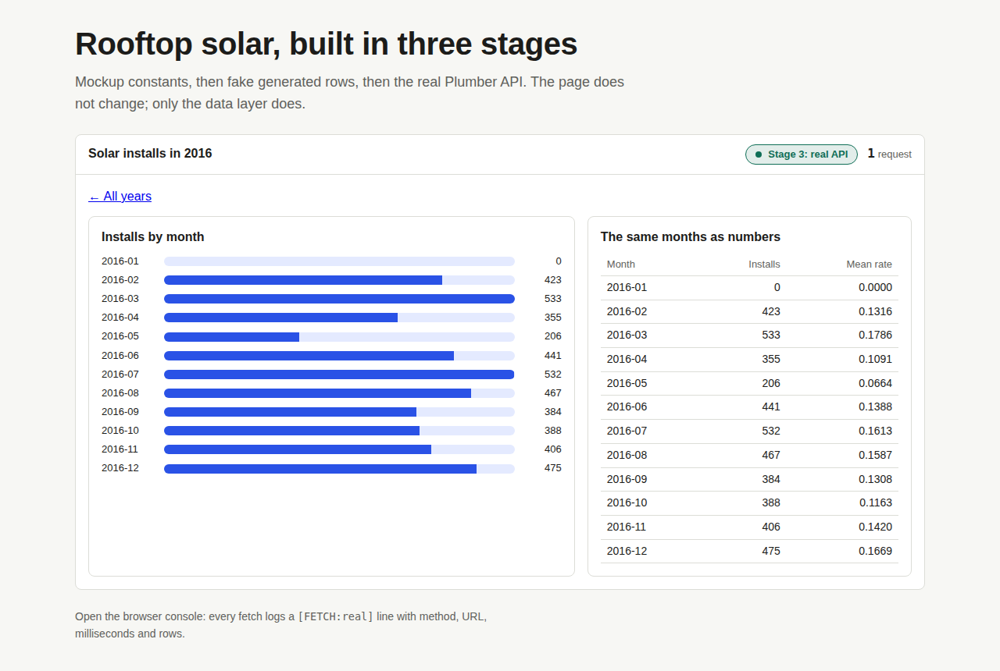
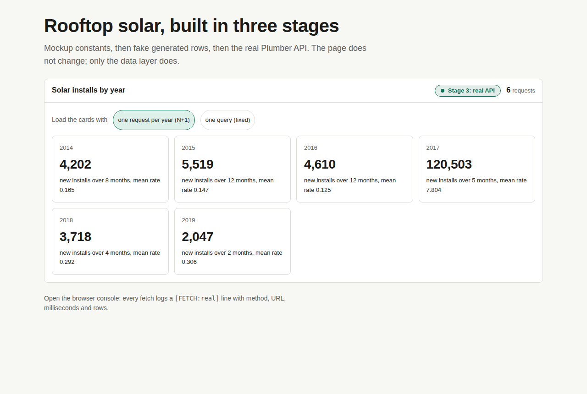

# app-staged: the staged build

One small dashboard (rooftop solar installs, from `exemplars/api-plumber`'s `GET /trend`) built the way an AI-assisted app should be built: **mockup constants, then fake generated rows, then the real API**, with the page unchanged between stages. It adds what a real app needs before it ships: two routes, one data-layer switch, a console line for every fetch, one N+1 shown and fixed, and a ship check that refuses while fake data is wired.

## Run it
```bash
npm ci
cp .env.example .env.local          # VITE_DATA_STAGE=mockup to start
npm run dev                          # http://localhost:5173
# stage 3 needs the API: from the repo root, Rscript exemplars/api-plumber/runme.R
npm run build                        # dist/
npm run ship-check                   # exits 1 unless VITE_DATA_STAGE=real and no fake data is in the build
```
In `npm run dev` only, `?stage=mockup|fake|real` in the address bar overrides the env var, and `?load=n1` opens the overview in its N+1 mode.

## The map
| File | Job |
|---|---|
| `src/data/index.js` | **The switch.** The only module that reads `VITE_DATA_STAGE`. Logs every fetch; counts requests. |
| `src/data/mockup.js` | Stage 1: four hand-typed months (tagged `STS_MOCKUP_DATA`). |
| `src/data/fake.js` | Stage 2: every month 2014-2019, seeded, with a zero month and an NA on purpose (tagged `STS_FAKE_DATA`). |
| `src/data/real.js` | Stage 3: `fetch` to the Plumber API. |
| `src/data/parse.js` | Converts API rows once (strings to numbers, NA to null); groups months into years. |
| `src/router.js` | A 20-line hash router: `#/` overview, `#/year/2016` detail. |
| `src/components/Overview.jsx` | Route 1, and the N+1 with its fix side by side. |
| `src/components/Detail.jsx` | Route 2: one request feeds the bars and the table. |
| `scripts/ship-check.mjs` | The ship check. |
| `src/styles/tokens.css`, `components.css` | Copied from the STS Starter Kit (never imported from the design folder). |

## The three stages
| | Stage 1 mockup | Stage 2 fake | Stage 3 real |
|---|---|---|---|
| Overview |  |  |  |

Detail route: 

The indicator in the header is amber for stages 1 and 2 and green for stage 3. Never deploy while it is amber.

## The N+1, shown and fixed
The overview has one card per year. The naive way asks `/trend?year=2014`, then `?year=2015`, and so on: **6 requests** for 6 cards, and one more every year. The fix asks `/trend` once and groups by year in `parse.js`: **1 request**. Same cards.

| One request per year (N+1) | One query (fixed) |
|---|---|
|  |  |

When no single query can answer, the other fix is a batched endpoint (`/trend?years=2014,2015,...`): ask your agent for it in `plumber.R`.

## Logging
Every call through the switch prints one line:
```
[FETCH:real] GET /trend?year=2016 150ms rows=12 (#1)
```
Stage, method, URL, milliseconds, rows, and the request number. Filter the console on `[FETCH:` to see every request. `VITE_DEBUG_FETCH=false` silences it.

## The ship check
`npm run ship-check` prints PASS/FAIL for three checks and exits 1 if any fails:
1. the production stage is `real`;
2. no file outside `src/data/` imports `mockup.js` or `fake.js`;
3. a fresh production build contains neither `STS_MOCKUP_DATA` nor `STS_FAKE_DATA`. In a production build `src/data/index.js` keeps only the stage it was built for, so the other stages' files are not in `dist/` at all.

## The integration pipeline in miniature
Going from fake to real is six small jobs. Each has a prompt card: what to ask your agent (Claude Code or Cursor), then what to check yourself.

**1. Extract the schema.** Write down every endpoint, its params and its columns, and every place the page reads them, before wiring anything.
> **Ask:** "Read `plumber.R` and `src/`. List every endpoint (path, params, the columns it returns with types) and every component that reads it (which fields). Mark any type you can't see in the code as unknown. Don't change any file."
> **Check:** `/trend` returns `month` (text `YYYY-MM`), `mean_solar_rate`, `total_solar`, `n_munis`. Every field the components use is on the list.

**2. Map the wiring.** For each input, which fetch runs and which components draw from it; flag chains that are still fake and components that ask for the same thing twice.
> **Ask:** "Using that list, map each chain: user action -> data call -> components. Mark each FAKE, WIRED or BROKEN, and flag N+1 candidates: two consumers calling the same endpoint, or one call per item in a list."
> **Check:** the overview's "one request per year" is flagged as N+1. The detail page is one chain with two consumers (bars and table), not two chains.

**3. Critique efficiency.** Collapse every N+1 before wiring real data, so you never wire the slow version.
> **Ask:** "For each N+1 you flagged, propose the fix: one query grouped on the client, a shared hook, or a batched endpoint. Show the request count before and after."
> **Check:** the counter in the header drops from 6 to 1 on the overview, and the cards are the same.

**4. Instrument logging first.** Add the console lines before the fix, so the fix proves itself.
> **Ask:** "Add one console line per fetch in `src/data/index.js` only: stage, method, URL, ms, rows. Behind a single on/off env var. Change no logic."
> **Check:** the console shows one `[FETCH:` line per request, and the count matches the header counter.

**5. Debug one module at a time.** Wire one chain to the real API; give the agent only that chain's files.
> **Ask:** "Wire only the detail route to the real `/trend?year=`. Files: `src/data/*`, `src/components/Detail.jsx`. Convert every field in `parse.js`; show loading, empty and error states. Touch nothing else."
> **Check:** with the API stopped, the page shows the error state (not a blank page); the NA month shows `NA`, not `0`.

**6. Assemble the patches and prove nothing fake is left.**
> **Ask:** "Merge the wired chains. List any file two changes touched. Search `src/` for mockup or fake imports outside `src/data/`. Then run `npm run ship-check` and paste its output."
> **Check:** `SHIP CHECK PASSED` with `VITE_DATA_STAGE=real`, and `SHIP CHECK REFUSED` if you set it back to `fake`.

## Deploy
Build with `VITE_DATA_STAGE=real` and `VITE_API_URL` set to your deployed API, run the ship check, then deploy `dist/` the way `exemplars/react-starter` does. Only `.env.example` is committed; `node_modules/` and `dist/` are gitignored.
