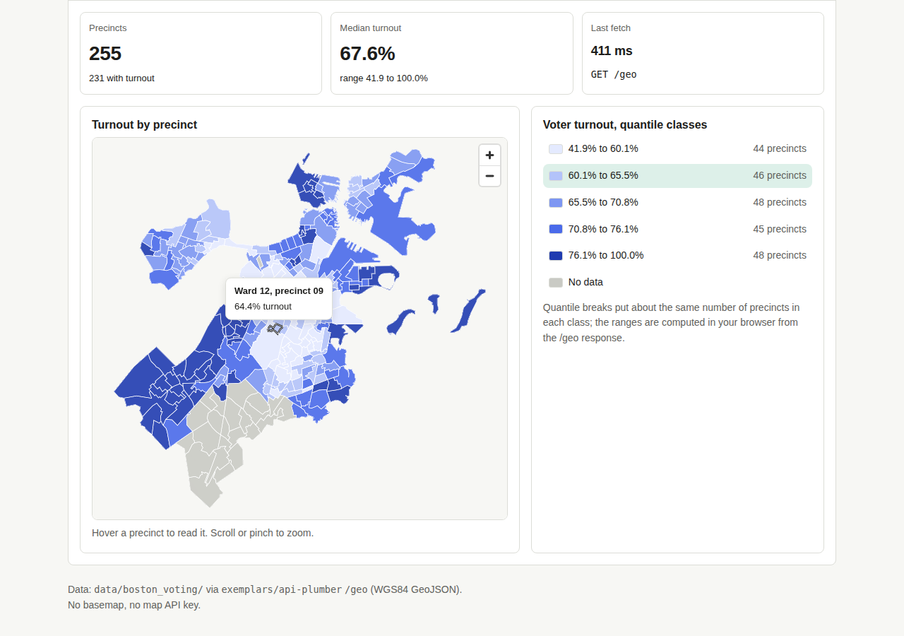

# react-map: a map that asks the API

A small, working Vite + React page. It asks the course's Plumber API
(`exemplars/api-plumber`) for `/geo`, gets back Boston's 255 voting precincts as
GeoJSON with 2020 voter turnout attached, and draws them with
[MapLibre GL JS](https://maplibre.org/) as a choropleth: a GeoJSON source, a
fill layer whose colour is a data-driven `step` expression, **quantile breaks
computed in the browser**, a legend that reads the same breaks, and a tooltip on
hover. Loading, empty and error states are handled. There is no basemap, so
there are no tiles, no third-party requests and no map API key: the precincts
are the map.



It is built on the `react-starter` scaffold (same `useApi` hook, same states,
same STS Starter Kit tokens copied into `src/styles/`), so read that exemplar
first.

## Run it (two terminals)

You need R with `plumber`, `dplyr`, `readr`, `sf` and `jsonlite`, and Node.js 20
or newer.

**Terminal 1: the API** (from the repo root):

```bash
Rscript exemplars/api-plumber/runme.R               # serves http://localhost:8000
curl -s "http://localhost:8000/geo" | head -c 300   # check it answers: a FeatureCollection
```

**Terminal 2: the page**:

```bash
cd exemplars/react-map
npm ci        # installs the exact versions in package-lock.json (MapLibre GL is pinned)
npm run dev   # open http://localhost:5173
```

`npm run build` writes the finished site to `dist/`; `npm run preview` serves it
on http://localhost:4173 with the same `/api` proxy. If your API runs on another
port, start Vite with `API_TARGET=http://localhost:8011 npm run dev`.

Try the states: stop the API and reload to see the error panel with Retry.

## What each file does

| File | Job |
|---|---|
| `../api-plumber/plumber.R` (`/geo`) | joins `data/boston_voting/precincts.geojson` to `boston_votes.csv`, simplifies in metres, **transforms to EPSG:4326**, writes GeoJSON (5 decimals, RFC 7946). About 160 kB instead of 560 kB. |
| `src/api/useApi.js` | the one fetch hook (from react-starter), plus `parseGeo()` (cleans properties, refuses non-degree coordinates) and `quantileBreaks()` |
| `src/components/TurnoutMap.jsx` | creates the MapLibre map **once**, adds the source and two layers, updates them with `setData()` / `setPaintProperty()`, drives the hover outline with `feature-state`, shows the tooltip |
| `src/components/Legend.jsx` | one row per class from the same breaks and colours; highlights the hovered class |
| `src/styles/tokens.css`, `components.css` | copied from the STS Starter Kit (header names the kit version) |
| `src/styles/app.css` | page layout, the map box, and the five `--ramp-*` colour tokens (light and dark) |
| `.env.example` | `VITE_API_URL` for the deployed page. No secrets: Vite bakes it into public files. |

## The CRS trap (read this before you ask an agent for a map)

**GeoJSON is always WGS84 longitude/latitude, EPSG:4326.** The GeoJSON standard
(RFC 7946) says so, and MapLibre, Leaflet and every web map assume it. If your
`sf` object is in a projected CRS (State Plane, UTM, anything in metres) and you
write it as GeoJSON without transforming it, the coordinates arrive as numbers
like `236000, 900000`. The map then draws nothing, or draws Boston somewhere in
the ocean, **and nothing errors**.

The fix is one line, always, just before writing:

```r
shapes = sf::st_transform(shapes, 4326)   # then st_write(..., driver = "GeoJSON")
```

Do it even when the source file "already looks like degrees": you cannot see a
CRS by eye, and a later edit (like simplifying in metres, which `/geo` does) can
change it. Two more checks this exemplar teaches:

- **Coordinates are `[longitude, latitude]`**, x before y. `center: [-71.06, 42.32]`
  is Boston; `[42.32, -71.06]` is Antarctica.
- **Simplify in metres, not degrees.** `st_simplify(dTolerance = 15)` means 15 m
  in EPSG:26986 but 15 *degrees* (the whole state) in EPSG:4326.

`parseGeo()` in `useApi.js` checks the first coordinate and turns a wrong CRS
into a readable error panel instead of a blank map.

## Quantile breaks, briefly

Quantile classes put about the same number of precincts in each colour (here
44 to 48 per class). `quantileBreaks(values, 5)` sorts the turnout values and
interpolates the 20th, 40th, 60th and 80th percentiles (R's default `type = 7`),
then the fill expression is

```js
['step', ['get', 'voter_turnout'], ramp1, b1, ramp2, b2, ramp3, b3, ramp4, b4, ramp5]
```

wrapped in a `case` that paints missing turnout grey. The legend is drawn from
the same `breaks` array, so the two cannot disagree.

## Prompt cards used to build it

Each card is the prompt given to the coding agent (Claude Code or Cursor), then
the thing checked afterwards. Use them the same way on your own project.

**1. The endpoint**
> Ask your agent: "Add a `GET /geo` route to `exemplars/api-plumber/plumber.R`
> that joins the Boston precinct polygons to `voter_turnout` by `ward_precinct`,
> simplifies them in a metre-based CRS, transforms to EPSG:4326, and returns
> GeoJSON with `application/geo+json`. Keep the payload under 200 kB. Change no
> other route."
>
> Check: `curl -s localhost:8000/geo | head -c 300` shows `-71.0…, 42.3…`
> (degrees, longitude first), and the response size is small.

**2. The layer**
> Ask your agent: "In a React component, create one MapLibre GL map with a blank
> style (a background layer only, no tiles, no API key). Add a GeoJSON source
> and a fill layer. Create the map once in a `useEffect` with `[]` deps; update
> the data with `setData` and the colours with `setPaintProperty`."
>
> Check: the map is created once (add a `console.log` in the effect; it prints
> once, twice in dev StrictMode, never on every hover), and there are no
> requests to any tile or font server in the Network tab.

**3. The breaks and the legend**
> Ask your agent: "Compute five quantile breaks from the turnout values in the
> browser, use them in a `step` fill expression with a `case` for null, and draw
> a legend from the same breaks array with a count per class."
>
> Check: the class counts are roughly equal, the top break ends at the maximum,
> and a precinct you hover sits in the legend row that lights up.

**4. Tooltips and states**
> Ask your agent: "Show a tooltip on hover with the ward, precinct and turnout,
> outline the hovered precinct with `feature-state`, and keep the loading,
> empty and error panels from react-starter."
>
> Check: stop the API and reload (error panel with Retry); hover a grey precinct
> ("No turnout data", not "NaN%").

**5. The CRS check**
> Ask your agent: "Make the page refuse, with a readable message, GeoJSON whose
> coordinates are not longitude/latitude."
>
> Check: temporarily comment out the final `st_transform(shapes, 4326)` line in
> `/geo` and restart the API. The shapes stay in EPSG:26986 metres after
> simplifying, and the page shows the error panel, not a blank map. Put the line back.

## Screenshots

`docs/shots/` holds headless-Chromium captures against the live local API
(`map-1280.png`, `map-390.png`, `map-390-dark.png`, all hovering a precinct) and
the error state (`state-error-390.png`).
