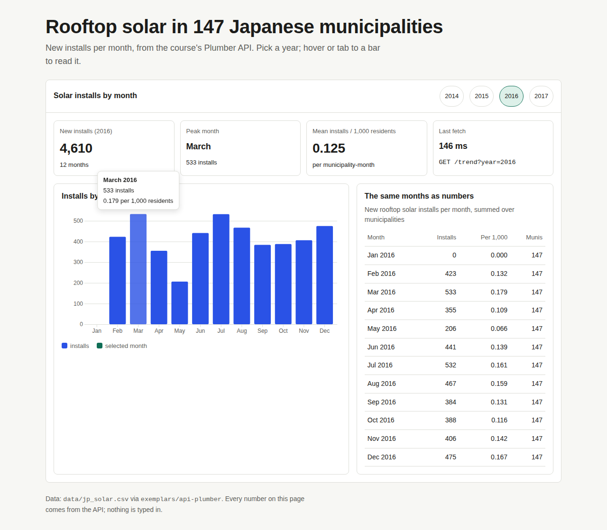

# react-starter: a page that asks the API

A small, working Vite + React page. It asks the course's Plumber API
(`exemplars/api-plumber`) for `/trend?year=2016` and shows the answer as a row of
KPI tiles, one D3 bar chart and one table. The page also handles loading, empty
and error states. It is one page and one endpoint, deliberately. Get this thin
slice working end to end first, then widen it.



## Run it (two terminals)

You need R with the `plumber`, `dplyr`, `readr`, `sf` and `jsonlite` packages,
and Node.js 20 or newer.

**Terminal 1: the API** (from the repo root):

```bash
Rscript exemplars/api-plumber/runme.R        # serves http://localhost:8000
curl "http://localhost:8000/trend?year=2016" # check it answers before you start the page
```

**Terminal 2: the page**:

```bash
cd exemplars/react-starter
npm ci        # installs the exact versions in package-lock.json
npm run dev   # open http://localhost:5173
```

`npm run build` writes the finished site to `dist/`. `npm run preview` serves
`dist/` on http://localhost:4173 with the same `/api` proxy, so you can check the
build before you deploy it.

Try the states. Stop the API (Ctrl+C in terminal 1) and press Retry to see the
error panel. Open `http://localhost:5173/?year=2013`, a year with no data, to see
the empty panel.

## What each file does

| File | What it is for |
|---|---|
| `index.html` | The one HTML page. React draws everything inside its `<div id="root">`. Loads the IBM Plex fonts. |
| `src/main.jsx` | The entry file. Imports the styles once and mounts `<App/>`. |
| `src/App.jsx` | The page: year chips, one `useApi` call, the KPI tiles, the chart and the table. It picks which state to show. |
| `src/api/useApi.js` | **The only file that calls `fetch`.** It tracks loading, error and data, cancels requests you no longer need, and holds the parsers that turn JSON strings into dates and numbers. |
| `src/components/TrendChart.jsx` | One D3 bar chart. React owns the `<svg>` and D3 draws inside it (`useRef` + `useEffect`). It has tooltips, and you can reach every bar with Tab and select it with Enter. |
| `src/components/TrendTable.jsx` | The same rows as a table, with the number columns right-aligned. |
| `src/components/States.jsx` | The loading, empty and error panels, using the kit's `.state` classes. |
| `src/styles/tokens.css`, `components.css` | **Copied** from the STS Starter Kit (`exemplars/design/sts-starter`). Each copy starts with a comment naming the kit version. Edit them here and never import them from the kit folder. |
| `src/styles/app.css` | The few styles this app adds: the page frame, the chart colours and the tooltip. It uses tokens only. |
| `vite.config.js` | The dev proxy: `/api/...` goes to `http://localhost:8000/...`. `base: './'` lets the build work at any URL. |
| `.env.example` | The one setting, `VITE_API_URL`. Copy it to `.env.local`. It is never secret, because it ends up in the built page. |
| `.github/workflows/deploy.yml` | Builds the page and publishes `dist/` to Posit Connect as a static site. See the Deploy section. |
| `package.json`, `package-lock.json` | Pinned versions: React 18.3.1, D3 7.9.0 and Vite 5.4.21. |
| `docs/shots/` | Screenshots of the working page (390 px and 1280 px wide, light and dark, all three states). |

## How the data flows

```
year chip -> useApi('/trend?year=2016') -> fetch('/api/trend?year=2016')
          -> Vite proxy -> Plumber /trend -> JSON {measure, n, data: [...rows]}
          -> parseTrend() (month string -> Date, NA -> null) -> rows
          -> KPI tiles, TrendChart, TrendTable (one request, three views)
```

## Deploy (Posit Connect, static site)

The page and the API deploy separately. Deploy the API first (see
`exemplars/api-plumber`, `deployme.R`) and note its URL. Then:

1. Copy this folder to the **root** of your own GitHub repository. GitHub only
   runs workflows in `.github/workflows/` at the root.
2. In Connect, create the content once. The simplest way is to run
   `npm run build` and publish `dist/` from the Connect UI as a static site
   (or with `rsconnect deploy html dist`). Copy its GUID from the content's
   Info panel.
3. In your repo, open Settings, then Secrets and variables, then Actions, and add:
   - secret `CONNECT_API_KEY`: your Connect API key. It is a secret, so it never
     goes in a file.
   - variable `CONNECT_CONTENT_GUID`: the GUID from step 2.
   - variable `VITE_API_URL`: your deployed API's URL.
   - secret `CONNECT_SERVER`: only if you are not using the course server
     (`https://connect.systems-apps.com`, tentative). The workflow names the
     server in one place.
4. On the API side, set its `ALLOWED_ORIGIN` Var in Connect to the page's
   origin, for example `https://connect.systems-apps.com`. In development the
   proxy made CORS irrelevant. In production the browser calls the API
   directly, so CORS applies.
5. Push. The workflow runs only when page files change. It uploads a bundle,
   starts the deploy, watches for 60 seconds, then detaches. "Detaching" in the
   log is normal. Connect finishes the deploy either way.

## The prompt cards used to build this

Each card is the prompt we gave a coding agent (Claude Code or Cursor) followed
by what we checked afterwards. AI-written code usually runs. Whether it is
right is what the Check line tests.

**1. The shared hook**
> **Ask your agent:** "Write `src/api/useApi.js`: one React hook `useApi(path)` that fetches `${API_BASE}${path}`, where `API_BASE` is `import.meta.env.VITE_API_URL` or `/api`. Return `{data, loading, error, retry}`. Check `res.ok`, cancel the request with an AbortController on unmount, and ignore AbortError. Add a `parseTrend` that converts the `month` string to a Date and every number field with `Number()`, turning null into null."
>
> **Check:** there is exactly one `fetch(` in `src/` (`grep -rn "fetch(" src`). In the browser's Network tab, switching years quickly cancels the old request. A month shows as "Mar 2016", never "Invalid Date". A 500 from the API shows the error panel, not a blank page.

**2. The chart**
> **Ask your agent:** "Write `src/components/TrendChart.jsx`: a D3 v7 bar chart of `installs` by month, drawn inside an `<svg>` that React owns via `useRef`, redrawn in `useEffect` when rows, width or the selection change. Use CSS classes for colour (bars `var(--data)`, the selected bar `var(--accent)`), a tooltip on hover and on keyboard focus, `tabindex=0` and an `aria-label` on each bar, and Enter to select. Resize with a ResizeObserver."
>
> **Check:** no hex colour in the component (`grep -n "#[0-9a-fA-F]\{3,6\}" src/components`). Press Tab until a bar has focus: the tooltip appears, Enter turns the bar green and highlights the table row, and focus stays on the bar. At 390 px the page does not scroll sideways. The dark theme recolours the chart.

**3. The states**
> **Ask your agent:** "Write `src/components/States.jsx` with Loading (the kit's `.state` card, a `.bar`, and the URL being fetched), Empty (the `.state.warn` card, with what to try) and ErrorState (the `.state.err` card, the message, the URL, and a Retry button). In App, show exactly one of loading, error, empty or content."
>
> **Check:** stop the API and reload. You see the error panel with Retry, never an empty card. Start the API and press Retry, and the chart comes back. Open `?year=2013` and you see the empty panel. Throttle the network to "Slow 3G" in DevTools to see the loading panel.

**4. CORS and the proxy**
> **Ask your agent:** "Add a Vite dev proxy so `/api/*` goes to `http://localhost:8000/*` with the `/api` prefix stripped, for both `npm run dev` and `npm run preview`. Do not call `http://localhost:8000` from the browser anywhere."
>
> **Check:** `grep -rn "localhost:8000" src` finds nothing. In the Network tab every request goes to `localhost:5173/api/...`, and there is no CORS error in the console. Before you deploy, the API's `ALLOWED_ORIGIN` names the page's real origin, not `*` and not `localhost`.

## Skills used

This exemplar was built with the `bridge-react-plumber` skill (CORS first, the
Vite proxy, explicit parsing, one shared hook) and the `vertical-slice` skill
(one endpoint, one page, end to end). The design comes from the STS Starter Kit.
