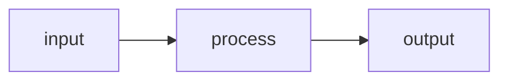
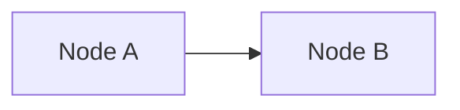
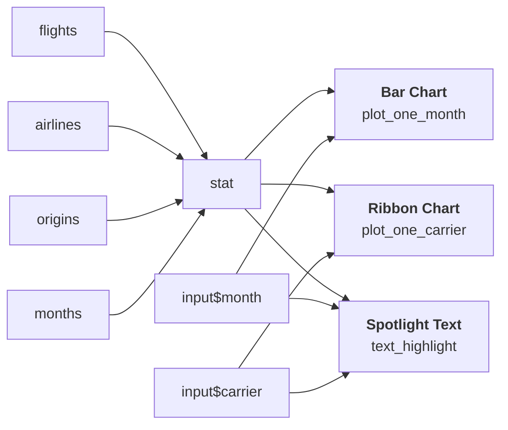
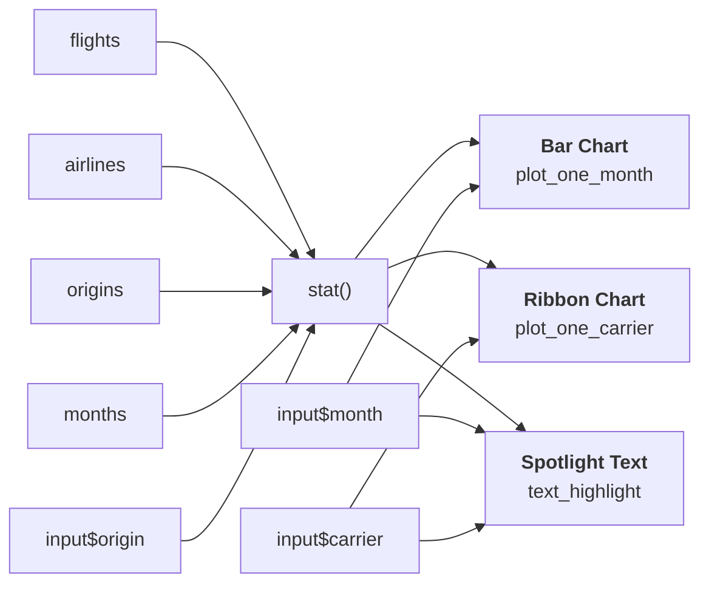
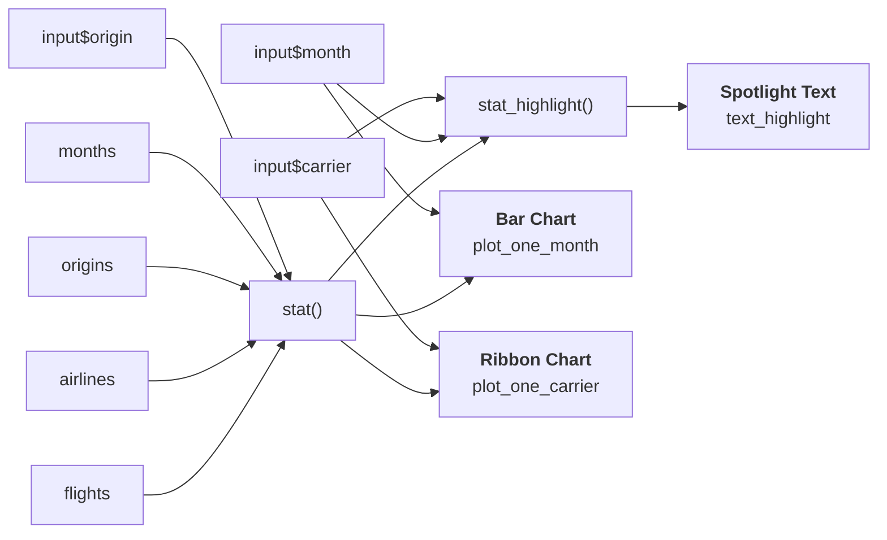

## Reactivity Diagram Examples

``` mermaid

flowchart LR

input --> process --> output
```

```mermaid

flowchart LR

%% Write a comment
thing1["Node A"]
thing2["Node B"]

%% Show a process
thing1 --> thing2


```

## Reactivity Diagram Phase 2A (app.3)

```mermaid
flowchart LR

%% What are our data sources
flights
airlines
origins
months


%% What are our inputs?
input$month
input$carrier

%% Make intermediate data
stat["stat"]


%% What are our outputs?
plot_bars["<b>Bar Chart</b><br>plot_one_month"]
plot_ribbon["<b>Ribbon Chart</b><br>plot_one_carrier"]
text_spotlight["<b>Spotlight Text</b><br>text_highlight"]

%% Map some input - intermediate processes

flights --> stat
airlines --> stat
origins --> stat
months --> stat


%% Map some intermediate - output processes
stat --> plot_bars
input$month --> plot_bars

stat --> plot_ribbon
input$carrier --> plot_ribbon


stat --> text_spotlight
input$month --> text_spotlight
input$carrier --> text_spotlight


```

```mermaid
flowchart LR

%% What are our data sources
flights
airlines
origins
months


%% What are our inputs?
input$origin
input$month
input$carrier

%% Make intermediate data
stat["stat()"]


%% What are our outputs?
plot_bars["<b>Bar Chart</b><br>plot_one_month"]
plot_ribbon["<b>Ribbon Chart</b><br>plot_one_carrier"]
text_spotlight["<b>Spotlight Text</b><br>text_highlight"]

%% Map some input - intermediate processes

flights --> stat
airlines --> stat
origins --> stat
months --> stat
input$origin --> stat


%% Map some intermediate - output processes
stat --> plot_bars
input$month --> plot_bars

stat --> plot_ribbon
input$carrier --> plot_ribbon


stat --> text_spotlight
input$month --> text_spotlight
input$carrier --> text_spotlight
```

## Reactivity Diagram Phase 2

```mermaid

flowchart LR

%% What are our data sources
flights
airlines
origins
months


%% What are our inputs?
input$origin
input$month
input$carrier

%% Make intermediate data
stat["stat()"]


%% What are our outputs?
plot_bars["<b>Bar Chart</b><br>plot_one_month"]
plot_ribbon["<b>Ribbon Chart</b><br>plot_one_carrier"]
text_spotlight["<b>Spotlight Text</b><br>text_highlight"]

%% Map some input - intermediate processes

flights --> stat
airlines --> stat
origins --> stat
months --> stat
input$origin --> stat


%% Map some intermediate - output processes
stat --> plot_bars
input$month --> plot_bars

stat --> plot_ribbon
input$carrier --> plot_ribbon


stat --> text_spotlight
input$month --> text_spotlight
input$carrier --> text_spotlight

```

```mermaid

flowchart LR

%% What are our data sources
flights
airlines
origins
months


%% What are our inputs?
input$origin
input$month
input$carrier

%% Make intermediate data
stat["stat()"]
stat_highlight["stat_highlight()"]

%% What are our outputs?
plot_bars["<b>Bar Chart</b><br>plot_one_month"]
plot_ribbon["<b>Ribbon Chart</b><br>plot_one_carrier"]
text_spotlight["<b>Spotlight Text</b><br>text_highlight"]

%% Map some input - intermediate processes

flights --> stat
airlines --> stat
origins --> stat
months --> stat
input$origin --> stat


%% Map some intermediate - output processes
stat --> plot_bars
input$month --> plot_bars

stat --> plot_ribbon
input$carrier --> plot_ribbon


stat --> stat_highlight
input$month --> stat_highlight
input$carrier --> stat_highlight

stat_highlight --> text_spotlight


```
